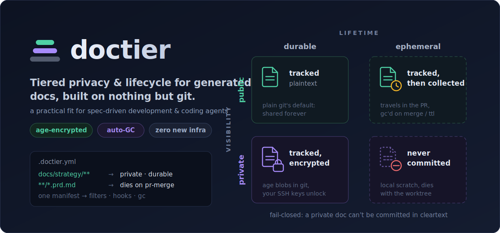

<p align="center">
  
</p>

# doctier

[](https://github.com/RubenGlez/doctier/releases/latest)

**Tiered privacy and lifecycle for generated documents, over git.** Works with any coding agent or workflow.

**Project page:** [rubenglez.dev/doctier](https://rubenglez.dev/doctier)

`doctier` is a single static Go binary that classifies the documents a project
generates along **two independent axes** and enforces that classification
automatically, using nothing but git primitives:

- **Visibility** — `public` (plaintext) · `private` (encrypted with [age](https://age-encryption.org), reusing your SSH keys)
- **Lifetime** — `durable` (forever) · `ephemeral` (finite life, auto-collected)

You describe the rules once in a user-owned manifest (`.doctier.yml`); `doctier`
turns each rule into the right git mechanism (plaintext tracking, an age
clean/smudge filter, scheduled deletion, or a gitignored local file) and refuses,
fail-closed, to let a private doc be committed in cleartext.

> Status: **early (v0.x), actively developed.** The core — manifest, age clean/smudge
> filters, fail-closed checks, merge driver, ephemeral GC, work-state-aware
> `doctier agents` — works end-to-end and ships as signed, notarized binaries.

<p align="center">
  
</p>

## Why it exists

AI coding workflows generate a lot of documents alongside the code: product
strategy, architecture notes, decision records, QA reports, PRDs written before a
feature, throwaway prototype notes. These documents have **two needs that git
does not model**:

- **Who can read them.** Some are safe to share (engineering docs, ADRs); others
  are the competitive edge (product strategy) and must not be readable by everyone
  who has the repo, nor leak to forks and mirrors.
- **How long they should live.** Some are permanent; others are transient — a PRD
  that is created before a feature, used during development and review, and should
  then disappear.

Git only has **one axis with two states**: a file is either *tracked* (visible to
anyone with the repo) or *ignored* (invisible and local). There is no native
"private but shared", and no "delete itself when a condition is met". So teams
fall back to workarounds: gitignoring a whole docs directory (nothing is backed up
or shared), committing docs to a working branch and deleting them by hand later
(fragile, and they get trapped in branches), or stashing them in GitHub Issues.

`doctier` builds the **two missing axes on top of git** instead of inventing a new
store, and it was designed from the start for **coding agents working in parallel
git worktrees**. Because tracked docs — public *and* private (encrypted) — travel
to every worktree through git's own checkout, an agent spawned in a fresh worktree
sees exactly the docs it should, with private ones already decrypted in its working
tree, and nothing extra to set up per worktree.

## How it works

The manifest `.doctier.yml` maps glob patterns to the two axes (first match wins).
You only write rules for the **exceptions** — a document that matches no rule is
`public` + `durable`, plain git's default (tracked plaintext, kept forever):

```yaml
version: 1
docs:
  - path: "docs/strategy/**"      # crown jewels
    visibility: private
    lifetime: durable
  - path: "**/*.prd.md"           # a PRD that travels in the PR and dies on merge
    visibility: public
    lifetime: ephemeral
    expire: { on: pr-merge }
  - path: "**/_scratch/**"        # sensitive scratch, never committed
    visibility: private
    lifetime: ephemeral
    sensitive: true               # dies with the worktree by default
recipients_file: .doctier/recipients.txt   # who can read private docs
```

`doctier` turns each rule into git primitives:

| Visibility | Lifetime | Storage |
|---|---|---|
| public | durable | tracked, plaintext |
| private | durable | tracked, encrypted (age clean/smudge filter) |
| public/private | ephemeral (not sensitive) | tracked; deleted at the trigger |
| any | ephemeral + `sensitive: true` | gitignored, local to the worktree; deleted at the trigger |

## Commands

| Command | What it does |
|---|---|
| `doctier init` | Scaffold `.doctier.yml`, `.gitattributes`, `.gitignore`, hooks and the clean/smudge filter. |
| `doctier check [--staged\|--push]` | Fail-closed policy check: the index (CI), staged files (pre-commit) or pushed commit trees (pre-push). |
| `doctier status` | Show the effective classification of each document. |
| `doctier doctor` | Health-check this clone: the git filter/diff/merge drivers, `.gitattributes` sync, hooks, recipients, key availability, and that every tracked private file is intact ciphertext. Exits non-zero on any problem, so it works as a CI gate. |
| `doctier unlock` | Decrypt private docs from the index into the working tree — for fresh clones and headless/CI runs (needs a key). |
| `doctier cat <path>` | Print one private doc's plaintext to stdout without writing it to disk (needs a key). |
| `doctier agents [--write] [--all]` | Emit a tier-aware context block for `AGENTS.md` / `CLAUDE.md` (print, or `--write` to maintain a managed block). Ephemerals are listed only while in flight for the current work unit; `--all` lists every one. |
| `doctier gc [--trigger ttl\|worktree\|pr-merge\|branch\|all]` | Collect expired ephemerals. |
| `doctier grant ["<ssh-pubkey>"]` | Add a recipient and re-encrypt private docs. With no key, just re-encrypt to the current set — the revoke flow: delete the recipient's line, then run `doctier grant`. |
| `doctier filter clean\|smudge <file>` | Git filter (invoked by git, not by hand). |
| `doctier textconv <file>` | Git diff driver: `git diff` shows private docs decrypted when a key is present (invoked by git, not by hand). |
| `doctier merge <O> <A> <B> <P>` | Git merge driver: 3-way merges private docs in plaintext and re-encrypts the result (invoked by git, not by hand). |

## Install

No Go toolchain required — pick one:

```bash
# Homebrew (macOS only — the artifact is a cask; this repo doubles as its own tap)
brew tap RubenGlez/doctier https://github.com/RubenGlez/doctier
brew install doctier

# Install script (Linux/macOS): downloads the right prebuilt binary and
# verifies it against the release's checksums.txt
curl -fsSL https://raw.githubusercontent.com/RubenGlez/doctier/main/install.sh | sh

# Or grab a binary from https://github.com/RubenGlez/doctier/releases

# With Go installed
go install github.com/rubenglez/doctier@latest
```

macOS binaries are signed with a Developer ID certificate and notarized by Apple, so
Gatekeeper runs them without a security prompt.

## Quick start

```bash
cd your-repo
doctier init
doctier grant "$(cat ~/.ssh/id_ed25519.pub)"
# edit .doctier.yml to classify your docs, then re-run 'doctier init'
# (it syncs .gitattributes/.gitignore with the rules)
doctier check
```

Decryption uses your SSH private key (`$DOCTIER_SSH_KEY`, else `~/.ssh/id_ed25519`
or `~/.ssh/id_rsa`). The key must be passphrase-less: git filters cannot prompt,
so a passphrase-protected key leaves private docs encrypted in your worktree (you
get a warning on checkout and from `doctier status`). Point `$DOCTIER_SSH_KEY` at
a dedicated key if your main one has a passphrase.

## Joining a repo that already uses doctier

A fresh clone checks out private docs as age ciphertext (`-----BEGIN AGE
ENCRYPTED FILE-----` blocks) — expected, not broken: the filter and hooks live
in `.git`, so they don't travel with the clone. To get to plaintext:

1. Install doctier and run `doctier init` in the clone — it wires the filter
   and hooks so future checkouts decrypt automatically.
2. Get granted: send your `~/.ssh/id_ed25519.pub` to someone who already has
   access; they run `doctier grant "<your key>"` and commit the result. You
   cannot self-serve by adding your own key — it can't decrypt blobs that were
   encrypted before it was a recipient. No key yet? `ssh-keygen -t ed25519`.
3. `git pull`, then `doctier unlock` — it decrypts the already-checked-out
   ciphertext into your working tree. (Plain `git checkout` / `git reset
   --hard` are no-ops here: git considers the files unmodified.)

`doctier unlock` never overwrites files that are already plaintext in your
working tree, so it is safe to re-run at any time. To read a single doc without
setup, `doctier cat <path>` prints its plaintext to stdout.

The same applies to headless environments — a CI job or a remote coding agent
has no granted key, so private docs stay ciphertext there (if an agent ever
pastes you an `AGE ENCRYPTED FILE` block, this is why). To deliberately give
such an environment read access — a dedicated key, granted by an existing
recipient, provisioned as a secret — see
[docs/agents.md](docs/agents.md).

## Walkthrough

A repo with four documents, one per cell of the matrix:

```
docs/architecture.md      # public  · durable
docs/strategy/roadmap.md   # private · durable
feature-x.prd.md           # public  · ephemeral (dies on PR merge)
_scratch/notes.md          # private · ephemeral · sensitive (never committed)
```

The manifest that classifies them — only the exceptions need a rule, so
`docs/architecture.md` is left to the implicit `public` + `durable` default:

```yaml
version: 1
docs:
  - path: "docs/strategy/**"
    visibility: private
    lifetime: durable
  - path: "**/*.prd.md"
    visibility: public
    lifetime: ephemeral
    expire: { on: pr-merge }
  - path: "**/_scratch/**"
    visibility: private
    lifetime: ephemeral
    sensitive: true
recipients_file: .doctier/recipients.txt
```

`doctier status` shows the effective classification and where each doc is stored.
Sensitive ephemerals are gitignored, so git (and therefore `status`) does not see
them — that is by design:

```
DOCUMENT                  VISIBILITY  LIFETIME   STORAGE          EXPIRES
docs/architecture.md      public      durable    git (plaintext)  —
docs/strategy/roadmap.md  private     durable    git (encrypted)  —
feature-x.prd.md          public      ephemeral  git (plaintext)  pr-merge
```

What happens as you work:

- **`docs/architecture.md`** — committed as normal plaintext. Travels to every
  clone and worktree.
- **`docs/strategy/roadmap.md`** — the clean filter encrypts it on `git add`, so
  the blob in git is age ciphertext; the smudge filter decrypts it on checkout, so
  it is plaintext in your working tree. Grant a teammate with
  `doctier grant "$(cat their_key.pub)"` and it is re-encrypted to include them.
- **`feature-x.prd.md`** — committed as plaintext and reviewed inside the PR. When
  the PR merges, the `post-merge` hook (or CI) runs `doctier gc --trigger pr-merge`,
  which `git rm`s it so it disappears from the tree.
- **`_scratch/notes.md`** — gitignored by `doctier init`, so it never reaches git.
  A fresh worktree starts without it (correct — it is scratch for that unit of
  work), and `git worktree remove` takes it with the worktree.

If you `git add` `docs/strategy/roadmap.md` without the filter applied, or stage
`_scratch/notes.md`, the `pre-commit` hook (`doctier check --staged`) blocks the
commit. Preview a cleanup without touching anything with `doctier gc --dry-run`.

## Agent skill

doctier ships an agent skill, `doctier-setup`, that classifies your generated docs
interactively: it scans the repo, asks how you treat specs, and writes
`.doctier.yml` for you — only asking about the exceptions (what's private, what's
ephemeral); everything else stays at the `public` + `durable` default. Install it
into your coding agent via [skills.sh](https://www.skills.sh):

```bash
npx skills add RubenGlez/doctier
```

The skill deliberately carries no opinions in the binary: the classification hints
(a snapshot of spec-driven-development conventions) live as editable data in the
skill, so they can be refreshed without a doctier release.

## Fail-closed guarantees

`doctier check` (wired as pre-commit and pre-push hooks, and run in CI) refuses
the commit if:

- a `private` file is staged in cleartext (filter not applied),
- a `sensitive` ephemeral is staged at all,
- a document matches no rule **and** you opted into `policy.uncovered: block`
  (off by default: uncovered docs are treated as `public` + `durable`;
  `policy.uncovered: warn` reports them without failing the check).

**Run `doctier check` in CI — it is the only host-independent guarantee.** The
clean/smudge filter lives in `.git/config` and the hooks in `.git/hooks`; neither
travels with the repo, so a fresh clone has no local protection until it runs
`doctier init`. CI inspects the committed blobs directly (filter installed or not),
so it is what makes the guarantee hold for every contributor. CI also drives the
`pr-merge` collection. On GitHub, the bundled action is one line:

```yaml
- uses: RubenGlez/doctier/action@main   # installs doctier and runs `doctier check`
```

Copy-paste recipes for [GitHub Actions](docs/ci/github-actions.yml)
and [GitLab CI](docs/ci/gitlab-ci.yml); neither needs your age key (check and gc
never decrypt). If a CI job or agent *should* read private docs, that is a
separate, deliberate grant — see [docs/agents.md](docs/agents.md).

## Known limitations

- `age` ciphertext leaves filenames, sizes and commit metadata visible; the
  content of a deleted tracked-ephemeral remains in git history (use
  `sensitive: true` for material that must leave no trace).
- **The policy itself is only as trusted as your review process.** `.doctier.yml`
  and the recipients file are tracked, unauthenticated files: anyone with commit
  access can reclassify a private path or add their own key. Gate them with
  CODEOWNERS / required review, and treat any diff to them as a security review.
- **Revocation is forward-only.** A removed recipient can still decrypt every
  version already in git history; re-encryption protects future changes only.
- **Merging concurrently edited private docs needs a key.** age ciphertext is
  randomized, so two branches touching the same private doc always collide; the
  `merge.doctier` driver (wired by `init`) decrypts both sides, 3-way merges the
  plaintext and re-encrypts the result. Real conflicts appear as plaintext
  markers in the working tree (the index keeps ciphertext). On a keyless machine
  the driver reports a conflict and tells you how to keep one side
  (`git checkout --ours/--theirs`).
- age has no authenticated associated data: encrypted blobs are not bound to
  their path or version, so a writer without keys can swap or roll back
  ciphertexts undetected.
- The `pr-merge` trigger is host-specific to detect reliably; `doctier gc` is the
  generic command — wire it from CI (primary), a local hook (reinforcement) and
  rely on `ttl` as the safety net.
- **`pr-merge` and `branch` collect by presence, not by a real merge event.** Both
  mean "this ephemeral is now on the integration branch", so a doc committed
  directly to `main` (trunk-based flow) is collected on the next run there — even
  seconds later. They are two spellings of the same collection path, differing only
  in the manifest vocabulary (`expire.on: pr-merge` vs `expire.scope: branch`).
- **`gc --trigger worktree` only prunes stale worktree bookkeeping.** Worktree-scoped
  `sensitive` files are removed by `git worktree remove` itself; this trigger does
  not delete them.
- **Pre-push / CI `check --push` validates the pushed tip trees, not every commit in
  the range.** Cleartext introduced and then removed in an intermediate commit of the
  same push is not inspected; only the tips are. Plaintext already in pushed history
  needs `git filter-repo` to scrub.
- **`LoadIdentity` needs a passphrase-less private key** (no ssh-agent or age-native
  identity support), which pushes toward keeping an unencrypted key on disk.
- **A missing `doctier` binary blocks git operations on private paths.** The filter
  is installed with `required=true` (fail-closed), so if doctier is uninstalled — or
  a GUI git client's PATH lacks the install dir (e.g. `~/.local/bin`) — checkouts and
  adds touching private files fail with git's opaque "external filter ... failed".
  Fix the client's PATH, or temporarily `git config filter.doctier.required false`.
- **Windows is not supported.** The hooks are `sh` scripts and nothing is tested
  under Git-for-Windows, so no Windows binaries are shipped (WSL works — it is
  just Linux).

Encryption is age-only by design (a separate private-repo backend is an explicit
non-goal).

## License

MIT — see [LICENSE](LICENSE).
